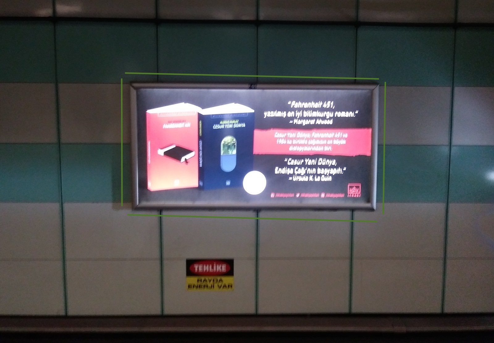
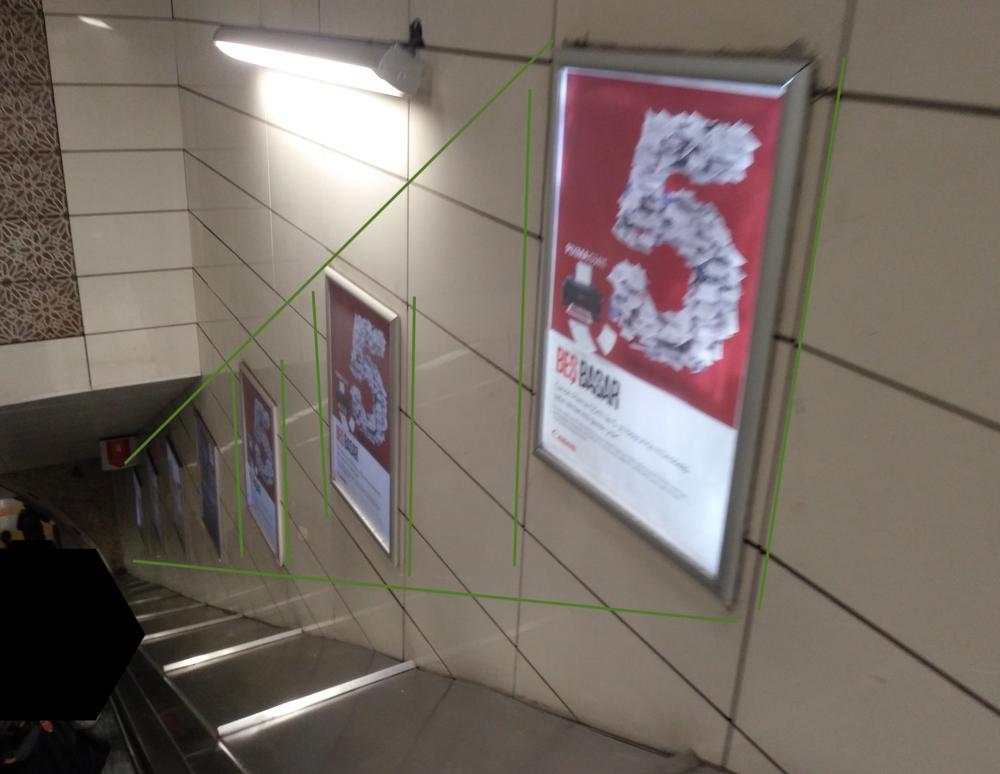
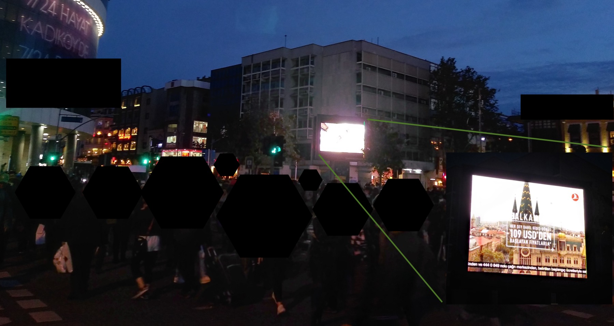

# Introduction

Goals to achieve:

>  explain "**the problem**" we're solving has <u>nothing to do</u> with "**ad serving**"

## Publisher - Advertiser - 3rd Party - Developer Chart

[click to edit document](https://docs.google.com/drawings/d/1IHB4AITMpO22l9W4LAQibspxEonUvutFxekyXkplE6Q/edit)

click [issues.md](./issues.md) to skip basic terms and move to issues document

## who is \_\_\_\_\_?

- previous dfp [repository](https://github.com/swoopertr/kodads) built by DYG, maintained by [serpilacar](https://github.com/serpilacar) (~~vngrs~~)
- recent dfp [repository](https://github.com/vedit/dygdfp) built by [vedit](https://github.com/vedit/) (~~vngrs~~) maintained by [xkema](https://github.com/xkema) (vngrs), [alienaut](https://github.com/alienaut) (~~vngrs~~), [kagansari](https://github.com/kagansari) (~~vngrs~~)

## Product Overview (`dygdfp` library)

click to continue with [development-method-and-technologies.md](./development-method-and-technologies.md)

## what is \_\_\_\_\_?

Sources for section content: 

- [https://support.google.com/admanager](https://support.google.com/admanager)
- [https://publisheruniversity.withgoogle.com](https://publisheruniversity.withgoogle.com)
- [https://en.wikipedia.org](https://en.wikipedia.org)

### Ad Manager (formerly DFP, DoubleClick for Publishers)

A full service ad serving platform, simplifies ad management utilities, provides a ready to use Ad Server.
- one central place for ad management (trafficking, networks, apps, games, websites)
- advanced forecasting
- revenue optimization (enables Google AdSense and Ad Exchange to compete against other networks in real-time)
- integrated into the overall DoubleClick family (all other ad related Google products and services)
- Ad Manager has automatically access to publisher sites comply with Google Ads guidelines, so Ad Manager also covers Google Ads by default.
- `what is DFP` infographic
  *last accessed date: 03/09/2018*

[click to see infographic source](https://publisheruniversity.withgoogle.com/dfp/en/training_content/infographic/videolibrary/5731150450393088.html?collection=DFPInfographic)

### Google Ads (formerly Google AdWords)

Enables <u>creating advertisements</u> which will appear on relevant Google search result pages and on other partner sites registered to Google Advertiser Network. (Google Display Network, a collection of 2 million websites, ~90% of overall public web according to comScore)

> This is also where we use Google Ads as an advertiser instead of a publisher.

### AdSense

AdSense <u>delivers Google Ads</u> to individuals' websites.

AdSense is the most simple way to monetize a web content by displaying targeted ads next to our digital content. Provides an instant and automatic access to huge source of advertisers.

On AdSense, we don't control which ads to show on our content, Google does it on behalf of us, and Google pays us on behalf of Advertisers on Google Advertiser Network.

Ad Manager also gives access to AdSense buyers to our inventory. 

> DYG network doesn't use AdSense

###  AdX or Ad Exchange (integrated into ad manager completely)

Ad Exchange is an online marketplace where buyers can purchase inventory from multiple participating sellers. Publishers can manage multiple buyers to get the highest yield at scale. See auction model [here](https://support.google.com/admanager/answer/152039).

Provides access to our very own inventory to Authorized Buyers (formerly AdX Buyers) such as Google itself. It is an *auction* and also a complete *sales* channel.

Ad Manager allows access to Ad Exchange accounts directly from Ad Manager interface.

Both AdSense and Ad Exchange provide access to millions of buyers while Ad Exchange provides granular controls over direct sales effort. See comparison [here](https://support.google.com/admanager/answer/4599464?hl=en).

### Ad Server

<u>Ad Server</u> is a web server (and all services relates to ad serving) where the advertising material stored and distributed.

### Inventory, Ad Unit, Placement, Key-Values

<u>Inventory</u> is the items we're selling to advertisers, sellable inventory. Our sites and apps are all inventory. (basicly all empty spaces on a website)

<u>Ad Unit</u> is a container to organize inventory, like folders and subfolders hierarchically organized under inventory. (building blocks of theese empty spaces a.k.a. inventory)

> A News Site sample:
>
> **Homepage > Americas > Top Stories > Arts > Film**
>
> from top level > to lower level

See Inventory Planning section of [Help Pages](https://support.google.com/admanager/answer/6026938?hl=en)

<u>Placement</u> is a group of ad units ogranized by a context used to reduce operational load.

<u>Key-Values</u> are extra information pairs to specifically match adunit's ad tag and line items & creatives, key-values are information sets hold ***not personally identifiable*** data. (see [Facebook fined for data breaches in Cambridge Analytica scandal](https://www.theguardian.com/technology/2018/jul/11/facebook-fined-for-data-breaches-in-cambridge-analytica-scandal)) Key-Values form targeting by defining specific identifiers to page or directly to an ad tag

### Ad Tag

A piece of code to be inserted into the source code of the page.

It consists of ad unit, placement, key-values, size etc..  and represents the space the ad will show up.

### Order

Once sales team sells an inventory to an advertiser, an order needs to be set up in Ad Manager. Order represents that campaign set up by publisher and advertiser. 

> **advertiser > order > line item > creative**
>
> acme inc. > summer campaign > mobile leaderboard 320x50 > some jpeg images

#### Line Item

Specifics of the order; total numbers of impressions, ad units, date, targeting , ...

##### Creative

Actual display files of the advertisement campaign. Possible types; Image, HTML5, 3rd Party, DoubleClick Tag etc..

See the restaurant analogy in [Appendix](#appendix) section

### An Ad Request Lifecycle

- Request reaches Ad Manager
- Ad Manager filters eligible Line Items
- Checks Ad Exchange for highest paying add (if set)
- Select and serve ads

> see **what is dfp** infographic above for detailed visual

### Header Bidding

Communication of an ad server through some custom header bidding code (as in `Criteo`) implemented in publishers webpage or mobile app (as in `publisher.js`)

### Exchange Bidding

Lets Ad Manager ad server communicate directly with third-party ad exchanges in a server-to-server connection (reduces page load latency and complex publisher configuration)

Exchange bidding, allows trusted 3rd party exchanges to compete with publisher's own ad manager and ad exchange inventory, all in one real-time auction.

It is a a server-to-server integration between Ad Manager and 3rd Party Exchange, it requires a contractual relationship between parties. (publisher and ad exchange) Server-to-server connection is the main difference between header bidding. (header bidding requires a wrapper script)

Yield Group is the organization of:

- what inventory we're selling to the 3rd party exchanges
- which exchanges we want to share this inventory with

### IAB

A nonprofit research & development consortium to help media and advertising companies implementing global technical standarts related to digital media and advertising.

[https://www.iab.com](https://www.iab.com)

### Better Ads Standarts

The Coalition for Better Ads is a coalition to improve consumer experience with advertising. Coalition develops and implements consumer friendly ad contents by using [various research](https://www.betterads.org/research/).

### Friendly Frame

An `<iframe>` eliminates; cross-site scripting limitations, iframe expanding limitations, dynamic ad size placement limitations, etc..

See note from [related IAB document](https://www.iab.com/wp-content/uploads/2015/09/rich_media_ajax_best_practices.pdf):

> ... the ads may make calls to document.write which interferes with the rest of an AJAX-based webpage. In order to solve these problems, the Ad Ops Council recommends a Friendly IFrame (FIF) solution...

### SafeFrame

An API enabled cross-domain `iframe`. Provides controlled communication between advertiser content and publisher content. (publisher content have to protect itself from unwanted access while providing a communication channel between these two, with this communication channel advertiser may collect data for viewability purposes or expand `iframe` size to show detailed creatives to user on demand)

See SafeFrame guideline at IAB [SafeFrame Guidelines page](https://www.iab.com/guidelines/safeframe)

### Request Mode

<u>Single Request Architecture</u>, SRA. All ad requests are sent to Ad Manager server at one time. (recommended request mode by Google)

A single `googletag.display` method call triggers all requests by a single one, first display call on a page does this.

<u>Multi-request</u>, each ad request is sent to Ad Manager separately from the body content, by the order of their appearance on DOM. Individual `googletag.display` method calls trigger an ad request to the corresponding ad slot.

>we don't use SRA, even if we use, lazyloading and on-demand slot creation prevents async pattern

<u>Batch SRA</u> > grouping ad slots into `n` groups and sending each grouped slot's request in a single request.

### Rendering Mode

<u>Asynchronous</u> allows content and ad slots to load separately. (recommended request mode by Google) Ads don't block page content and page content vice versa.

<u>Synchronous</u> Ad slots renders directly on the page, content blocks ad slot rendering, ad slots block content rendering.

SRA + Asynchronous combination is the recommended way.

> we use asynchronous rendering mode but act like synchronous

## Roadblocks

Serving several creatives from a specific line item together on the same page. (tries to block other creatives) It blocks other ad slots on a page and fill them from a single line item. Roadblocks don't prevent multiple line items from being served to a webpage.

*Guaranteed Roadblocks*, guarantees that <u>all creatives</u> on a line item will be served to the page. Works with single request mode and requires enabling related feature in Ad Manager. (*Admin > Global Settings > Features*) 

*Non-Guaranteed Roadblocks* no need to enable Ad Manager global setting, *Display Creatives > "As many as possible"* setup 's enough to achieve non-guaranteed roadblocks.

See other tagging considerations (impression counting, same size slots, frequency capping, ..) to use roadblocks here [https://support.google.com/admanager/answer/2666920?hl=en&ref_topic=2666611](https://support.google.com/admanager/answer/2666920?hl=en&ref_topic=2666611) and here [https://support.google.com/admanager/answer/177277?hl=en&ref_topic=2666611](https://support.google.com/admanager/answer/177277?hl=en&ref_topic=2666611)

Roadblocks are never guaranteed at all, even if we use guaranteed version!

### Reporting

Actual measured resulting numbers of campaign. Holy resulting data.

### Remarketing

Showing ads to people who've visited a website or mobile app previously. (remarketing reconnects people left your site without buying anything)

### Ads.txt

Declares a list of digital sellers to improve transperancy in programmatic advertising. (Authorized Digital Sellers is an initiative from IAB)

File keeps the list of advertisers authorized to sell our own inventory

### AMP, AMP Ads

An open source library to build up fast & smooth mobile web pages. AMP sites are cached and served by Google. Library has a component-based architecture, all components have their uniqe interface.

`<amp-ad>` tags are designed to serve ad content on amp pages, with `<amp-ad>` tag it is not possible to:

- serve custom rendered creatives (as in pageskin, ligatus, ...)
- work with third parties (if there are not implemented amp versions of their services)
- use `http` in any content or component (`https` is mandatory)
- define custom behaviours (expand collapse buttons, resize containers, ...)

## Inventory Around Me

Samples of an urban ad inventory around streets, public transportation etc...

## A Bigger Picture

[click to edit document](https://docs.google.com/drawings/d/1ooNbpfyCTCPeXQGO6A12DMFzAXwyaRK62cIXxnUYRGs/edit)

## Useful Links

- [https://support.google.com/admanager](https://support.google.com/admanager) [ad manager support page]
- [https://developers.google.com/doubleclick-gpt/reference](https://developers.google.com/doubleclick-gpt/reference) [gpt developer reference]
- [https://publisheruniversity.withgoogle.com](https://publisheruniversity.withgoogle.com) [publisher university home]
- [https://www.iab.com](https://www.iab.com) [interactive advertising bureau official site]
- [https://dfpgpt.appspot.com](https://dfpgpt.appspot.com) [tag generator app]

## Appendix

### A Restaurant Analogy #1 (single restaurant)

[click to edit document](https://docs.google.com/drawings/d/15FPfqJiAe_irjHyZhPMdXW8ZV4CIwhHnd5hwVl8up7w/edit)

### A Restaurant Analogy #2 (chain of restaurants)

[click to edit document](https://docs.google.com/drawings/d/1FiwgzKgNfrLnVBZ1fhs91OJcR_xjMpY3_UCSRd7r1fc/edit)
