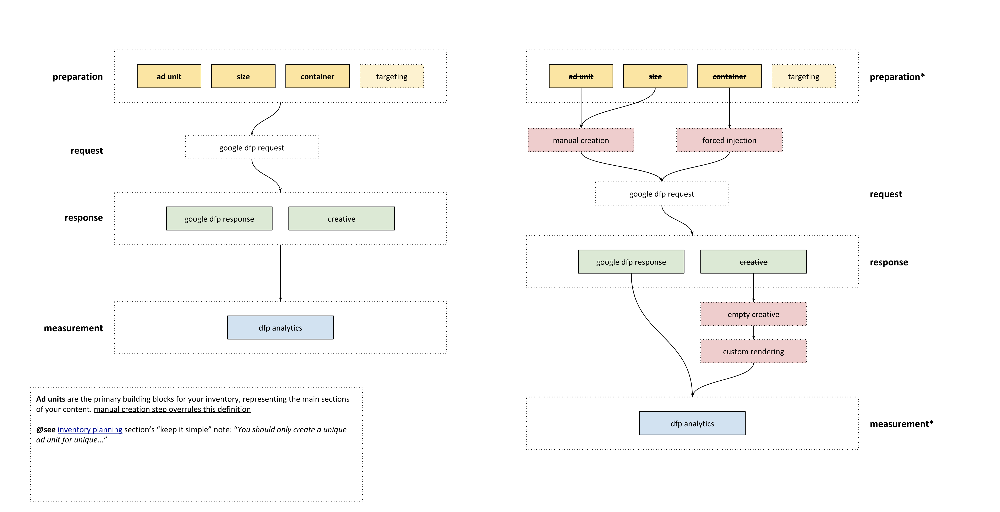
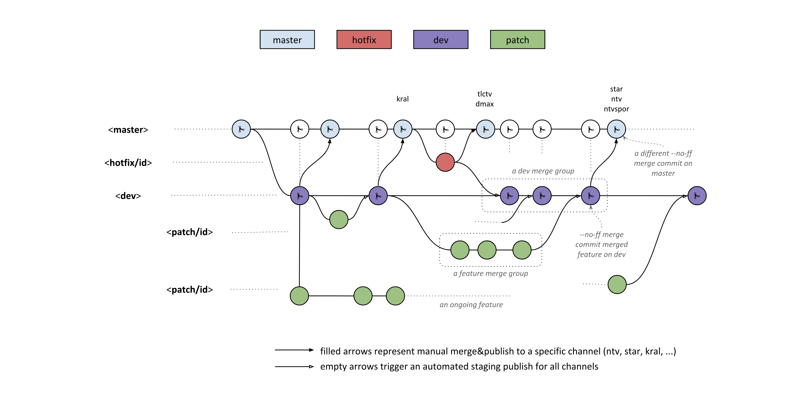

# issues

- grouped by bad parts

## design related issues (1)

- style related
  - **demo#0**
    - [first steps](https://xkema.github.io/untitled-ad-manager-demos/src/my-shiny-site-as-a-publisher/)
    - **don't forget to**: *<u>deactivate ad-blockers, privacy protecters for demo</u>*
- behavioral
- maintaining 19 different projects see [#information-architecture-related-issues](##information-architecture-related-issues)

## information architecture related issues (2)

- lifecycle for ad slots on a page



- missing `<meta>` tags
- missing ad unit tails
- **demo#1**
  - [placing ads to page manually](https://xkema.github.io/untitled-ad-manager-demos/src/my-shiny-site-as-a-publisher/category.html)

```
# single site ia layout
site
|__ desktop
  |__ content-type-1
  |__ content-type-2
  |__ content-type-3
  |__ ...
  |__ content-type-N
|__ tablet
  |__ content-type-1
  |__ ...
  |__ content-type-N
|__ mobile
  |__ content-type-1
  |__ ...
  |__ content-type-N
```

- ad manager related shortcomings
  - reporting issues???
- no async behaviour
  - **demo#2**
    - [final page](https://xkema.github.io/untitled-ad-manager-demos/src/my-shiny-site-as-a-publisher/category-detail.html)

### number of variations (2.1)

<u>Total Number of Injections In Use</u>: **1445** 

> 290 web\|tablet\|mobile `content-type`, 5 ad slots per `content-type`

<u>Total Number of Injections Expected by Crawler</u>: **1545**

> 309 web\|tablet\|mobile `content-type`, 5 ad slots per `content-type`

## 3rd party  related issues (3)

- tr scenario
  - no online documentation
  - no direct support
- globals
  - insufficient documentation
  - direct support
- insiders\*
- bonus system\*

## communication  related issues (4)

- all parties are related to each other, but some parties communicate
- advertiser's problem is developer's problem
- dt boosts:
  - physical disadvantage
  - communication channel expands

## code base  related issues (5)

- git flow
- `%6` test coverage
- tightly coupled to current developer(s)
- `harmonyjs` dependency
- documented but!
- not scalable, expands to unknown
- not-measured
  - by development
  - by traffickers
- customization hell




